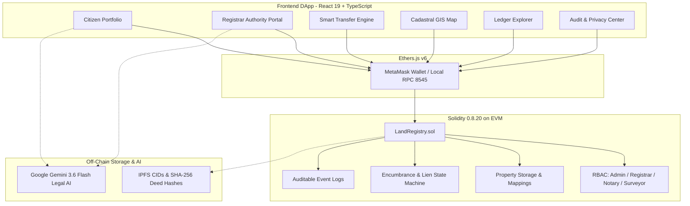

<div align="center">

# 🏛️ Blockchain-Based Land Registry & Property Ownership System

<p align="center">
  <strong>A decentralized, tamper-evident cadastral land registry, automated title conveyance, and legal verification platform powered by Solidity, Hardhat, Ethers.js, React 19, and Google Gemini AI.</strong>
</p>

<p align="center">
  <a href="https://soliditylang.org/"></a>
  <a href="https://hardhat.org/"></a>
  <a href="https://react.dev/"></a>
  <a href="https://vitejs.dev/"></a>
  <a href="https://tailwindcss.com/"></a>
  <a href="https://deepmind.google/technologies/gemini/"></a>
  <a href="https://opensource.org/licenses/MIT"></a>
</p>

<p align="center">
  <a href="#-key-features">Key Features</a> •
  <a href="#-system-architecture">Architecture</a> •
  <a href="#-quick-start">Quick Start</a> •
  <a href="#-smart-contract">Smart Contract</a> •
  <a href="#-automated-tests">Testing</a> •
  <a href="#-documentation">Documentation</a> •
  <a href="#-license">License</a>
</p>

---

</div>

## 📌 Executive Overview

Traditional land registry databases suffer from centralized points of failure, administrative corruption risks, slow manual due diligence, double-selling fraud, and unverified physical deed manipulation.

This project delivers a complete, production-grade Web3 prototype simulating **tamper-evident cadastral parcel registration**, **decoupled authority verification**, **peer-to-peer ownership conveyance**, and **active lien/dispute locks**. Physical deeds and survey maps are secured off-chain via SHA-256 cryptographic digests, while the Solidity smart contract manages immutable ownership state and complete transfer audit logs.

---

## ✨ Key Features

| Feature | Description |
|:---|:---|
| 🛡️ **Role-Based Access Control (RBAC)** | Strict administrative separation of concerns between `Admin`, `Land Registrar`, `Cadastral Surveyor`, and `Authorized Notary`. |
| 📜 **Cadastral Title Modeling** | 16-field on-chain property data model tracking parcel codes, GPS districts, zoning, freehold ownership, and verification state. |
| 🔒 **Automated Lien & Dispute Locks** | Autonomous smart contract guards strictly prevent title transfers while active mortgage liens, municipal taxes, or boundary disputes exist. |
| 🔍 **Off-Chain Hash Integrity** | Computes SHA-256 digests of physical survey documents, ensuring instant mathematical detection of altered or forged deeds (`[TAMPER DETECTED]`). |
| 🗺️ **Interactive GIS Cadastral Map** | Real-time SVG polygon rendering with status color codes (Verified, Pending, Encumbered, Disputed) and satellite orthophoto mode. |
| 🤖 **Google Gemini 3.6 Flash AI** | Live AI legal engine for automated title integrity conflict audits, plain-English legal explainers for citizens, and cadastral market valuations. |
| 🦊 **Dual Web3 & Persona Mode** | Connect via live **MetaMask** on local EVM (Chain ID: `31337`), or switch instantly between 4 simulated personas (Citizen, Registrar, Notary, Auditor). |
| 🧪 **100% Automated Test Coverage** | 20 comprehensive Hardhat unit tests covering all edge cases, access control invariants, and state transitions. |

---

## 🏗️ System Architecture



---

## 🚀 Quick Start

### Prerequisites
* **Node.js**: `v18+` (Tested on `v20` / `v22` / `v24`)
* **NPM**: `v9+`
* **MetaMask Extension** (Optional for live Web3 testing)

### 1. Clone the Repository
```bash
git clone https://github.com/abdr492/Blockchain-Based-Land-Registry-Property-Ownership-System.git
cd Blockchain-Based-Land-Registry-Property-Ownership-System
```

### 2. Install Dependencies
```bash
npm install
```

### 3. Configure Environment Variables
Create a `.env` file in the root directory (or copy from `.env.example`):
```env
GEMINI_API_KEY="your_google_gemini_api_key_here"
APP_URL="http://localhost:3000"
```

### 4. Compile Smart Contracts
```bash
npm run hardhat:compile
```

### 5. Launch Local EVM Node & Deploy (Optional for live Web3)
```bash
# Terminal 1: Start local node (Chain ID: 31337)
npm run hardhat:node

# Terminal 2: Deploy contract and seed sample parcels
npm run hardhat:deploy
```

### 6. Start the Interactive Frontend DApp
```bash
npm run dev
```
Open **[http://localhost:3000](http://localhost:3000)** in your web browser.

---

## 📜 Smart Contract Specification (`LandRegistry.sol`)

The `contracts/LandRegistry.sol` contract is compiled with Solidity `0.8.20` using the Yul Intermediate Representation (`viaIR: true`) and 200 optimizer runs.

```solidity
struct Property {
    string propertyId;        // Unique parcel ID (e.g. "PROP-NY-2024-401")
    string titleNumber;       // Sovereign title deed code (e.g. "TIT-NY-8892401")
    string parcelId;          // Cadastral plot code (e.g. "CAD-SEC4-LT12")
    string cadastralDistrict; // Municipal administrative jurisdiction
    string physicalAddress;   // Full street address
    uint256 areaSqMeters;     // Land area in square meters
    string zoning;            // "Residential", "Commercial", "Agricultural", etc.
    address currentOwner;     // Current owner wallet address
    address previousOwner;    // Previous owner wallet address
    string documentHash;      // SHA-256 hash of original deed
    string ipfsDeedCid;       // Content identifier on IPFS
    bool isVerified;          // Authority approval status
    PropertyStatus status;    // REGISTERED, VERIFIED, TRANSFERRED, IN_DISPUTE, ENCUMBERED
    uint256 registeredAt;     // Registration timestamp
    uint256 lastTransferredAt;// Last conveyance timestamp
    bool exists;              // Existence flag
}
```

### Core Functions

| Category | Function | Access | Description |
|:---|:---|:---|:---|
| **Roles** | `setRegistrar(address, bool)` | `onlyAdmin` | Grants/revokes Land Registrar municipal permissions. |
| **Roles** | `setNotary(address, bool)` | `onlyAdmin` | Grants/revokes Authorized Notary permissions. |
| **Roles** | `setSurveyor(address, bool)` | `onlyAdmin` | Grants/revokes Cadastral Surveyor permissions. |
| **Registration** | `registerProperty(...)` | `onlyRegistrarRole` | Registers new parcel with SHA-256 document hash. |
| **Verification** | `verifyProperty(propertyId, cid)` | `onlyNotary/Surveyor` | Decoupled verification confirming survey and legal covenants. |
| **Conveyance** | `transferOwnership(...)` | `onlyPropertyOwner` | Conveys title deed; enforces zero-address, lien, and dispute guards. |
| **Liens** | `addEncumbrance(...)` | `onlyNotaryRole` | Attaches mortgage or tax lien; automatically locks transfer status. |
| **Liens** | `releaseEncumbrance(...)` | `onlyNotaryRole` | Discharges active lien; restores verified status. |
| **Disputes** | `flagDispute(propertyId, reason)` | Owner / Registrar | Flags boundary contest; halts transfer until resolved. |
| **Disputes** | `resolveDispute(propertyId, notes)`| `onlyRegistrarRole` | Settles boundary dispute with on-chain resolution notes. |

---

## 🧪 Automated Unit Testing

Run the full **20-case test suite** with Mocha, Chai, and Hardhat:

```bash
npm run hardhat:test
```

```text
  LandRegistry Smart Contract Comprehensive Test Suite
    ✔ 1. Should deploy successfully with the deployer set as admin and default roles assigned
    ✔ 2. Should allow admin to grant and revoke registrar, notary, and surveyor roles
    ✔ 3. Should revert if non-admin attempts to grant or revoke roles
    ✔ 4. Should allow authorized Registrar to register a new parcel and emit PropertyRegistered
    ✔ 5. Should revert when registering a duplicate property ID
    ✔ 6. Should revert when registering with zero address as owner
    ✔ 7. Should revert when registering with area equal to zero
    ✔ 8. Should revert when unauthorized user attempts to register a property
    ✔ 9. Should allow authorized Notary to verify registered property and update status
    ✔ 10. Should revert if property is verified more than once
    ✔ 11. Should revert when verifying a non-existent property
    ✔ 12. Should revert when unauthorized caller attempts to verify property
    ✔ 13. Should allow current owner to transfer verified title to buyer and emit OwnershipTransferred
    ✔ 14. Should update currentOwner, previousOwner, and owner property mappings after transfer
    ✔ 15. Should revert when transferring an unverified property
    ✔ 16. Should revert when non-owner (or previous owner) tries to transfer property
    ✔ 17. Should revert when transferring to zero address
    ✔ 18. Should revert when transferring to current owner itself
    ✔ 19. Should block transfer when an active mortgage/lien encumbrance exists, and permit transfer after discharge
    ✔ 20. Should block transfer when a boundary dispute is active, and permit transfer once resolved

  20 passing (2s)
```

---

## 🔐 Off-Chain Document Tamper-Detection Demo

To demonstrate cryptographic tamper detection of physical deed files:

```bash
node scripts/hash-document.cjs
```

```text
================================================================
  OFF-CHAIN DOCUMENT HASH INTEGRITY & TAMPER DETECTION DEMO
================================================================

1. Original Document Path: sample_documents/property_001.json
   Original SHA-256 Hash : 0xe3d38838a495ef125635b5acae677cbec990a7896640fca0a492500fbc778832

2. Tampered Document Created: hashes/property_001_tampered.json
   Tampered SHA-256 Hash   : 0xf5ec08fe596e4db983df097e3b94146c4b9b94919149e6eedac641fb0047385e

3. Cryptographic Verification:
   Original == Tampered?   : false
   [TAMPER DETECTED] The modified document produces a completely different hash!
   Smart Contract on-chain record will immediately reject this forged deed.
================================================================
```

---

## 📁 Repository Structure

```text
Blockchain-Based-Land-Registry-Property-Ownership-System/
├── contracts/
│   └── LandRegistry.sol          # Main Solidity Smart Contract (0.8.20)
├── scripts/
│   ├── deploy.cjs                # Deployment and local ledger seeding script
│   └── hash-document.cjs         # SHA-256 tamper-detection demonstration script
├── test/
│   └── LandRegistry.test.cjs     # 20-case Hardhat automated unit test suite
├── sample_documents/
│   └── property_001.json         # Off-chain sample cadastral deed document
├── hashes/                       # Cryptographic hash proofs and tampered samples
├── docs/
│   ├── architecture.md           # Detailed 3-tier architecture and workflows
│   ├── concepts.md               # 20+ Web3 & Blockchain concepts explained
│   ├── security.md               # Threat model, 13 security controls & GIGO analysis
│   ├── simulation-guide.md       # 15-step virtual simulation guide (Remix & Hardhat)
│   ├── interview-prep.md         # Top 10 placement technical interview Q&A
│   └── github-upload-strategy.md # Git commit history and repository metadata
├── reports/
│   └── project-report.md         # Full academic course project report
├── src/
│   ├── components/               # 16 React UI components (GIS Map, Portals, Explorer)
│   ├── context/                  # RegistryContext state manager & Web3 bridge
│   ├── contracts/                # Exported contract ABI & deployed address JSON
│   ├── utils/                    # Web Crypto API & Ethers.js helper utilities
│   └── types.ts                  # TypeScript interface definitions
├── hardhat.config.cjs            # Hardhat configuration (Solidity 0.8.20, viaIR)
├── package.json                  # Project dependencies & npm run scripts
└── README.md                     # Master project documentation
```

---

## 📚 Supplementary Documentation

| Document | Purpose |
|:---|:---|
| [System Architecture](docs/architecture.md) | Full 3-tier system architecture diagrams, sequence flows, and permission tables. |
| [Blockchain Concepts](docs/concepts.md) | Comprehensive reference explaining 20+ blockchain & smart contract concepts. |
| [Security & Threat Model](docs/security.md) | In-depth threat matrix (13 mitigations), GIGO boundary analysis, and legal constraints. |
| [Virtual Simulation Guide](docs/simulation-guide.md) | 15-step walkthrough for testing on Remix IDE with 4 test accounts. |
| [Academic Project Report](reports/project-report.md) | Formal course report formatted with Abstract, Architecture, Methodology, and Results. |
| [Technical Interview Prep](docs/interview-prep.md) | Top 10 predicted placement interview questions and model answers. |

---

## ⚖️ Educational Disclaimer

> [!NOTE]
> This project is developed as an **educational proof of work** for blockchain course curriculum, technical portfolios, and placement demonstrations. All property parcels, cadastral numbers, and personal identities are **synthetic dummy data**. It does not create legally enforceable property ownership in any sovereign jurisdiction.

---

## 👨‍💻 Author & Attribution

* **Developer**: [abdr492](https://github.com/abdr492)
* **Project**: Blockchain-Based Land Registry & Property Ownership System
* **License**: [MIT License](LICENSE)
