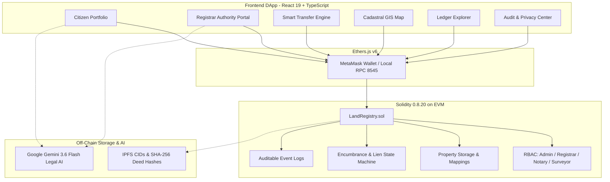

<div align="center">

# 🏛️ Blockchain-Based Land Registry & Property Ownership System

<p align="center">
  <strong>A decentralized, tamper-evident cadastral land registry, automated title conveyance, and legal verification platform powered by Solidity, Hardhat, Ethers.js, React 19, and Google Gemini AI.</strong>
</p>

<p align="center">
  <a href="https://soliditylang.org/"></a>
  <a href="https://hardhat.org/"></a>
  <a href="https://react.dev/"></a>
  <a href="https://vitejs.dev/"></a>
  <a href="https://tailwindcss.com/"></a>
  <a href="https://deepmind.google/technologies/gemini/"></a>
  <a href="https://www.linkedin.com/in/abdulrahman-anas"></a>
</p>

---

</div>

## 📌 Overview

Traditional land administration systems face critical challenges: centralized single-point-of-failure architectures, slow multi-week manual due diligence, unauthorized record manipulation, and double-sale fraud.

The **Blockchain-Based Land Registry & Property Ownership System** is a decentralized application that brings end-to-end transparency, immutability, and automation to land records. By combining EVM smart contracts with cryptographic document hashing and artificial intelligence, the platform ensures that land titles cannot be covertly edited, forged, or transferred without proper role-based authorizations.

---

## ✨ Features

### 🛡️ Decentralized Cadastral Registry
* **Role-Based Access Control (RBAC)**: Strict permission boundaries for `Admin`, `Land Registrar`, `Cadastral Surveyor`, and `Authorized Notary`.
* **Decoupled Verification Pipeline**: Registration and legal title verification are treated as independent steps, mirroring real-world land administration standards.
* **Immutable Title History**: Every ownership transfer, boundary confirmation, and mortgage attachment is permanently recorded on-chain.

### 🔒 Autonomous Security & Lien Guards
* **Mortgage & Lien Enforcement**: Smart contracts automatically lock title transfers when active bank mortgages or tax liens exist.
* **Boundary Dispute Lock**: Instant dispute flagging halts property sales until a certified surveyor and registrar issue a resolution.
* **Off-Chain Cryptographic Integrity**: Physical title deeds and survey reports are hashed using SHA-256 (`[TAMPER DETECTED]`), ensuring any forged or modified document is immediately rejected.

### 🗺️ Geospatial GIS Mapping & Data Privacy
* **Interactive Cadastral Map**: Visualizes land plots as interactive SVG vector polygons with real GPS coordinate overlays, status color codes, and satellite orthophoto mode.
* **GDPR Article 17 Compliance**: Sensitive citizen personal identifiable information (PII) is encrypted off-chain with AES-256-GCM, maintaining privacy while preserving zero-knowledge on-chain validity.

### 🤖 Google Gemini 3.6 Flash AI Integration
* **Plain-English Deed Explainer**: Translates complex legal covenants, rights, and smart contract triggers into clear, accessible language for citizens.
* **AI Title Integrity Audit**: Evaluates chain of custody, zoning constraints, and legal risks, generating instant compliance scores and recommendations.
* **Cadastral Market Valuation**: AI appraisal evaluating regional land appreciation, tax duty assessments, and market comparables.

### 🦊 Dual Execution: Live Web3 & Multi-Persona Mode
* **MetaMask Web3 Bridge**: Connect via live MetaMask on local Hardhat EVM (Chain ID: `31337`) with 1-click network switching.
* **Simulated Persona Sandbox**: Seamlessly toggle between 4 personas (Citizen, Registrar, Notary, Auditor) for rapid testing and demonstrations without requiring testnet gas.

---

## 🏗️ System Architecture



---

## 🚀 Quick Start

### Prerequisites
* **Node.js**: `v18+` (Tested on `v20` / `v22` / `v24`)
* **NPM**: `v9+`
* **MetaMask Extension** (Optional for live Web3 testing)

### 1. Clone the Repository
```bash
git clone https://github.com/abdr492/Blockchain-Based-Land-Registry-Property-Ownership-System.git
cd Blockchain-Based-Land-Registry-Property-Ownership-System
```

### 2. Install Dependencies
```bash
npm install
```

### 3. Configure Environment Variables
Create a `.env` file in the root directory (or copy from `.env.example`):
```env
GEMINI_API_KEY="your_google_gemini_api_key_here"
APP_URL="http://localhost:3000"
```

### 4. Compile Smart Contracts
```bash
npm run hardhat:compile
```

### 5. Launch Local EVM Node & Deploy (Optional for live Web3)
```bash
# Terminal 1: Start local node (Chain ID: 31337)
npm run hardhat:node

# Terminal 2: Deploy contract and seed sample parcels
npm run hardhat:deploy
```

### 6. Start the Interactive Frontend DApp
```bash
npm run dev
```
Open **[http://localhost:3000](http://localhost:3000)** in your web browser.

---

## 📁 Repository Structure

```text
Blockchain-Based-Land-Registry-Property-Ownership-System/
├── contracts/
│   └── LandRegistry.sol          # Main Solidity Smart Contract (0.8.20)
├── scripts/
│   ├── deploy.cjs                # Deployment and local ledger seeding script
│   └── hash-document.cjs         # SHA-256 tamper-detection demonstration script
├── test/
│   └── LandRegistry.test.cjs     # 20-case Hardhat automated unit test suite
├── sample_documents/
│   └── property_001.json         # Off-chain sample cadastral deed document
├── hashes/                       # Cryptographic hash proofs and tampered samples
├── docs/
│   ├── architecture.md           # Detailed 3-tier architecture and workflows
│   ├── concepts.md               # 20+ Web3 & Blockchain concepts explained
│   ├── security.md               # Threat model, 13 security controls & GIGO analysis
│   ├── simulation-guide.md       # 15-step virtual simulation guide (Remix & Hardhat)
│   ├── interview-prep.md         # Top 10 placement technical interview Q&A
│   └── github-upload-strategy.md # Git commit history and repository metadata
├── reports/
│   └── project-report.md         # Full academic course project report
├── src/
│   ├── components/               # 16 React UI components (GIS Map, Portals, Explorer)
│   ├── context/                  # RegistryContext state manager & Web3 bridge
│   ├── contracts/                # Exported contract ABI & deployed address JSON
│   ├── utils/                    # Web Crypto API & Ethers.js helper utilities
│   └── types.ts                  # TypeScript interface definitions
├── hardhat.config.cjs            # Hardhat configuration (Solidity 0.8.20, viaIR)
├── package.json                  # Project dependencies & npm run scripts
└── README.md                     # Master project documentation
```

---

## ⚖️ Educational Disclaimer

> [!NOTE]
> This project is developed as an **educational proof of work** for blockchain course curriculum, technical portfolios, and placement demonstrations. All property parcels, cadastral numbers, and personal identities are **synthetic dummy data**. It does not create legally enforceable property ownership in any sovereign jurisdiction.

---

## 👨‍💻 Author & Connect

* **Author**: Abdulrahman Anas
* **GitHub**: [@abdr492](https://github.com/abdr492)
* **LinkedIn**: [linkedin.com/in/abdulrahman-anas](https://www.linkedin.com/in/abdulrahman-anas)

---

## 📄 License
This project is open-source and available under the [MIT License](LICENSE).
